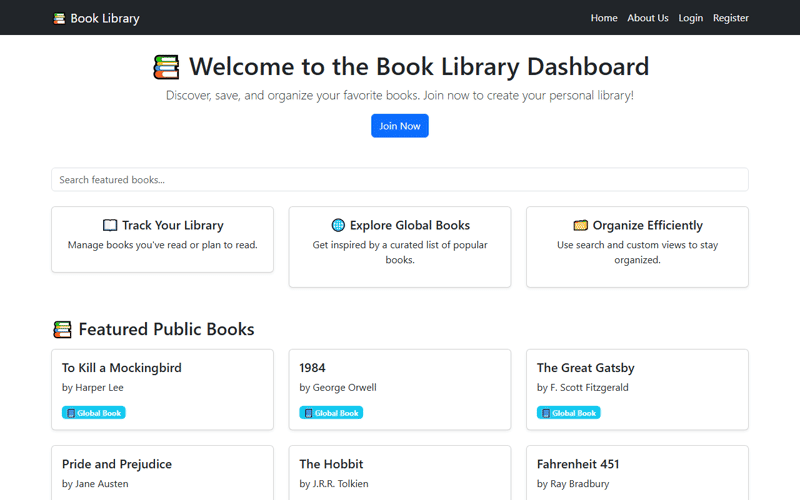
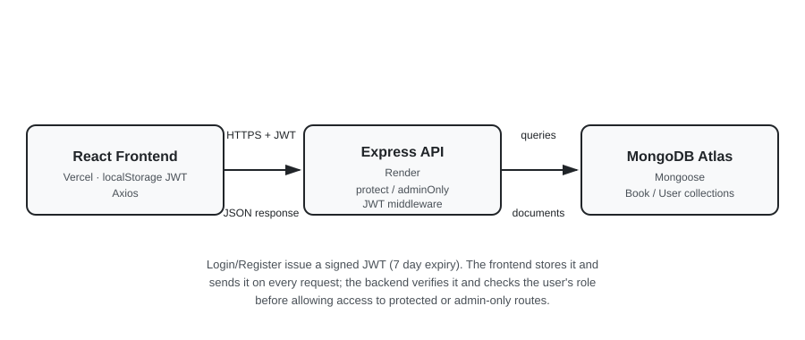

# Book Library Dashboard

A full-stack library management platform with role-based access for administrators and users, built with React, Node.js, Express, and MongoDB.

### Live Demo

| Type | URL |
|------|-----|
| **Frontend (Live Site)** | [book-library-dashboard.vercel.app](https://book-library-dashboard.vercel.app/) |
| **Backend API** | [book-library-dashboard.onrender.com/api/books/public](https://book-library-dashboard.onrender.com/api/books/public) |

[](https://book-library-dashboard.vercel.app)



---

## Project Overview

Users can register, log in, add personal books, browse public books, and manage their own entries. Admins have extended control over global book visibility, user submissions, and platform-wide inventory.

---

## Tech Stack

### Frontend
- **React.js**: component-based UI
- **React Router DOM**: client-side navigation
- **React Bootstrap**: responsive styling
- **Axios**: API communication

### Backend
- **Node.js + Express.js**: RESTful API server
- **MongoDB + Mongoose**: database and schema modeling
- **JWT (jsonwebtoken)**: stateless authentication
- **bcryptjs**: password hashing

### Dev & DevOps
- **Jest + Supertest**: automated backend testing
- **GitHub Actions**: CI/CD pipelines (lint, test, deploy)
- **Docker + Docker Compose**: containerized local development
- **Vercel**: frontend hosting
- **Render**: backend hosting
- **Postman**: manual API validation

---

## Architecture



---

## Authentication

- JWT-based login and registration
- Role-based access control: `admin` vs `user`
- Auth token stored in `localStorage` and validated server-side on every protected request

---

## Features

| Feature | Status | Description |
|---------|--------|-------------|
| REST API Endpoints | ✅ Done | Full CRUD and filtered endpoints |
| JWT Auth & Role-Based Access | ✅ Done | Admin and user roles with protected routes |
| Global Book Filter | ✅ Done | Toggle between public and private books |
| Admin User Submission View | ✅ Done | Separate read-only table for user-submitted books |
| Dashboard Filtering | ✅ Done | Admins see public/private; users see all/my/global |
| Book Ownership Metadata | ✅ Done | Tracks which user added each book |
| Automated Testing | ✅ Done | Jest + Supertest for key API routes |
| CI/CD Pipeline | ✅ Done | GitHub Actions for lint, test, and auto-deploy |
| Docker Support | ✅ Done | Docker Compose for local dev, multi-stage production images |

---

## Testing

### Automated (Jest + Supertest)
Key backend routes tested:
- `GET /api/books/public`: returns public book list
- `POST /api/users/login`: invalid credentials return 401
- Protected routes: unauthenticated requests are blocked

```bash
cd backend
npm test
```

### Manual (Postman)
All CRUD routes (login, register, books) validated via Postman collections.

---

## Folder Structure

```
book-library-dashboard/
├── .github/
│   └── workflows/
│       ├── backend-ci.yml
│       ├── deploy-backend.yml
│       └── frontend-ci.yml
├── backend/
│   ├── config/
│   ├── controllers/
│   ├── middleware/
│   ├── models/
│   ├── routes/
│   ├── tests/
│   ├── Dockerfile
│   ├── index.js
│   ├── seed.js
│   └── package.json
├── frontend/
│   ├── public/
│   ├── src/
│   │   ├── components/
│   │   ├── pages/
│   │   ├── context/
│   │   └── App.js
│   ├── Dockerfile
│   └── package.json
├── docker-compose.yml
└── README.md
```

---

## Run Locally

### 1. Clone the repository
```bash
git clone https://github.com/zainab-yekta/book-library-dashboard.git
cd book-library-dashboard
```

### 2. Backend setup
```bash
cd backend
npm install
```

Create a `.env` file inside `/backend`:
```
MONGO_URI=your_mongodb_uri
JWT_SECRET=your_jwt_secret
NODE_ENV=development
PORT=5000
```

```bash
npm run dev
```

### 3. Frontend setup
```bash
cd ../frontend
npm install
```

Create a `.env` file inside `/frontend`:
```
REACT_APP_BACKEND_URL=http://localhost:5000
```

```bash
npm start
```

---

## Running with Docker

If you have Docker installed, you can skip the manual setup above:

```bash
docker compose up
```

This starts MongoDB, the backend (port 5000), and the frontend (port 3000) together. Code changes on your machine are picked up automatically. Stop everything with `docker compose down`.

---

## Known Limitations

This project is still evolving, a few gaps worth knowing about:

- Automated test coverage is light: a handful of Jest/Supertest cases on the backend, none yet on the frontend.
- Backend tests currently run against the same database as everything else rather than an isolated test database.
- No rate limiting or centralized error handling on the API yet.
- Still built with Create React App; a move to Vite (and possibly TypeScript) is on the radar.

---

## Author

Built by **Zeinab Ramezani Yekta**, Full-Stack Developer  
[LinkedIn](https://linkedin.com/in/zeinab-ramezani) · [GitHub](https://github.com/zainab-yekta)
